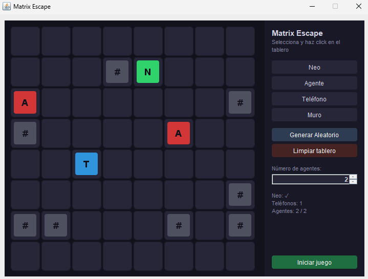

# **Concurrent Matrix Escape**

Colombian School of Engineering Julio Garavito

Diego Alejandro Montes Bonilla

Software Architectures

---

## **Game Description**

Matrix Escape is a game where you control the setup of a simulation in which Neo tries to escape the Matrix. Unlike a turn-based game, here Neo and the Agents move simultaneously in a race against time using concurrent execution threads.

---

## **Game Rules**

### **Objective**
- Neo (N): Must reach any telephone to escape the Matrix.
- Agents (A): Must capture Neo before he escapes.

### **Board Elements**
- N = Neo (Green square)
- A = Agent (Red square)
- T = Telephone (Blue square)
- # = Wall (Grey striped block)

### **Board**
- Size: 8x8 grid.
- The player can place the elements manually by clicking on the board or use the Generate Random button.
- Neo and Agents: Move on their own by calculating the shortest path using the BFS (Breadth-First Search) algorithm.

---

## **How Concurrency Works**

The game is not turn-based. Neo and each of the Agents are an independent thread that inherits from the abstract class PersonajeMovil.

1. Non-Deterministic Race: All threads compete to move. Each time they take a step, they sleep for a random amount of time. The thread that sleeps the least is the fastest and wins the race to the destination cell.
2. Mutual Exclusion: The Tablero class serves as shared memory. All movements that modify the matrix are synchronized to prevent race conditions where two characters try to occupy the same cell at the same time.

---

## **Architectural Improvements (Single Responsibility Principle)**

1. Isolated BFS: Instead of having all the massive algorithmic logic in the Tablero, the routing algorithm (BFS) was extracted to the threads' base class PersonajeMovil.
2. Snapshots: Threads ask the board for a photo and calculate their route on it. This prevents locking the entire board while a thread thinks, which drastically improves performance and concurrent fluidity.
3. Decoupled UI: The graphical interface VentanaJuego uses standard Swing components with dark colors applied directly, reducing the complexity of the graphical code and separating the view from the model.

---

## **Class by Class Explanation**

### **Package: `edu.eci.arsw.matrix.app`**
- `Main`: The entry point of the application. Its only responsibility is to start the graphical interface on the Swing execution thread.

### **Package: `edu.eci.arsw.matrix.core`**
- `Tablero`: The shared memory of the game. It contains the matrix with the positions of the elements. It provides `synchronized` methods to move characters safely, preventing race conditions. It also determines if the game has ended.

### **Package: `edu.eci.arsw.matrix.concurrency`**
- `PersonajeMovil`: Abstract class that extends `Thread`. It is the base for all characters. It contains the generic `calcularRuta` (BFS) method that allows characters to find the shortest path based on a snapshot of the board without blocking other threads.
- `Neo`: Thread representing Neo. Its logic consists of looking for the closest telephone and moving towards it one step at a time.
- `Agente`: Thread representing an Agent. Its logic consists of finding where Neo is and moving one step towards him to capture him.

### **Package: `edu.eci.arsw.matrix.ui`**
- `VentanaJuego`: The main window of the game. It handles user interaction, the setup panel (placing walls, agents, Neo, etc.), and the buttons to start the game.
- `PanelTablero`: The custom component responsible solely for drawing the game board using Java 2D graphics.

